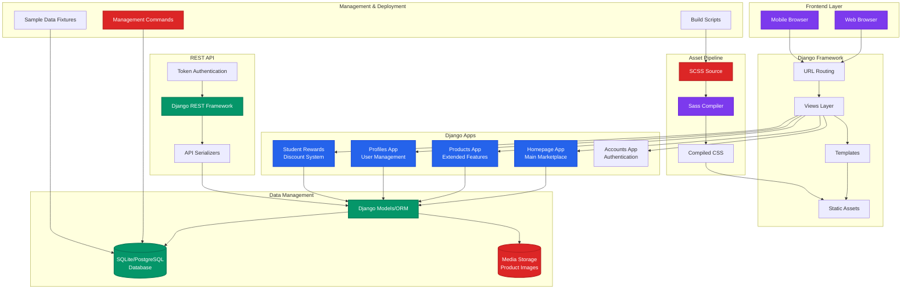

# MarketHub Django WebApp - Project Structure Analysis

## Executive Summary

MarketHub is a Django-based e-commerce marketplace web application designed for the Cape Town area, specializing in second-hand goods trading. The project follows Django best practices with a modular architecture, REST API support, and comprehensive feature set including user authentication, product management, shopping cart, payment processing, and student rewards system.

## Directory Tree Structure

```
MarketHub-Django-WebApp/
├── markethub/                          # Django project root
│   ├── __init__.py
│   ├── settings.py                     # Main Django settings with environment configuration
│   ├── urls.py                         # Root URL configuration  
│   ├── wsgi.py                         # WSGI application entry point
│   ├── asgi.py                         # ASGI application entry point
│   └── views.py                        # Project-level views
│
├── homepage/                           # Main app - consolidated product & homepage functionality
│   ├── __init__.py
│   ├── admin.py                        # Django admin configuration
│   ├── apps.py                         # App configuration
│   ├── models.py                       # Core models (Product, Cart, Order, Payment, etc.)
│   ├── views.py                        # Main business logic views
│   ├── forms.py                        # Django forms
│   ├── urls.py                         # Homepage URL patterns
│   ├── serializers.py                  # DRF serializers
│   ├── api_views.py                    # REST API endpoints
│   ├── api_urls.py                     # API URL patterns
│   ├── context_processors.py           # Template context processors
│   ├── tests.py                        # Unit tests
│   │
│   ├── management/                     # Django management commands
│   │   ├── commands/
│   │   │   ├── setup_sample_data.py    # Create sample marketplace data
│   │   │   ├── create_sample_categories.py
│   │   │   ├── create_sample_hero_slides.py
│   │   │   ├── create_sample_promotions.py
│   │   │   ├── sync_product_image_paths.py
│   │   │   ├── check_product_images.py
│   │   │   └── validate_env.py         # Environment validation
│   │   │
│   ├── migrations/                     # Database migrations
│   │   ├── 0001_initial.py
│   │   ├── 0002_update_store_lite_to_markethub.py
│   │   └── 0003_add_payment_and_draft_models.py
│   │
│   ├── templates/homepage/             # Django templates
│   │   ├── base.html                   # Base template
│   │   ├── index.html                  # Homepage
│   │   ├── product_list.html           # Product listings
│   │   ├── product_detail.html         # Product detail page
│   │   ├── cart.html                   # Shopping cart
│   │   ├── checkout.html               # Checkout process
│   │   ├── login.html, signup.html     # Authentication
│   │   ├── seller_dashboard.html       # Seller management
│   │   ├── components/                 # Reusable template components
│   │   │   ├── hero_slider.html
│   │   │   ├── category_grid.html
│   │   │   ├── promotion_banners.html
│   │   │   ├── newsletter_signup.html
│   │   │   ├── search.html
│   │   │   ├── loading.html
│   │   │   └── api_client.html
│   │   └── includes/                   # Template includes
│   │       ├── footer_about.html
│   │       ├── footer_categories.html
│   │       └── product_search.html
│   │
│   ├── static/                         # Static assets
│   │   ├── homepage/                   # App-specific static files
│   │   │   ├── css/promotions.css
│   │   │   └── js/newsletter.js
│   │   └── MarketHub/                  # Brand-specific assets
│   │       ├── markethub.js            # Main JavaScript
│   │       ├── style.css               # Main CSS (compiled)
│   │       ├── css/
│   │       │   ├── markethub.css       # Compiled SCSS
│   │       │   └── accessibility-improvements.css
│   │       └── scss/                   # SCSS source files
│   │           ├── markethub.scss      # Main SCSS file
│   │           └── _markethub_variables.scss
│   │
│   └── templatetags/                   # Custom template tags
│       ├── __init__.py
│       └── currency_filters.py         # South African Rand formatting
│
├── products/                           # Legacy products app (consolidated into homepage)
│   ├── models.py                       # Imports from homepage.models
│   ├── views.py                        # Product-specific views
│   ├── urls.py                         # Product URL patterns
│   ├── admin.py, apps.py, forms.py     # Standard Django app files
│   ├── management/commands/            # Product management commands
│   │   ├── populate_sample_data.py
│   │   ├── check_product_images.py
│   │   └── check_all_product_images.py
│   ├── migrations/                     # Product model migrations
│   └── templates/products/             # Product-specific templates
│       ├── product_list.html
│       ├── product_detail.html
│       └── favorites_list.html
│
├── profiles/                           # User profile management
│   ├── models.py                       # UserProfile model
│   ├── views.py                        # Profile management views
│   ├── admin.py, apps.py               # Standard Django app files
│   └── migrations/                     # Profile migrations
│
├── student_rewards/                    # Student discount system
│   ├── models.py                       # StudentProfile, DiscountTier, PointsTransaction
│   ├── views.py                        # Rewards system views
│   ├── urls.py                         # Rewards URL patterns
│   ├── serializers.py                  # Student rewards API serializers
│   ├── admin.py, apps.py               # Standard Django app files
│   ├── management/commands/            # Rewards management commands
│   │   └── create_sample_rewards_data.py
│   ├── migrations/                     # Rewards system migrations
│   └── templates/student_rewards/      # Rewards templates
│       └── base.html
│
├── accounts/                           # Authentication app (minimal)
│   ├── models.py, views.py, admin.py   # Standard Django auth extensions
│   └── migrations/
│
├── staticfiles/                        # Collected static files (production)
│   ├── admin/                          # Django admin static files
│   ├── homepage/                       # Homepage static files
│   ├── MarketHub/                      # MarketHub branded assets
│   └── rest_framework/                 # DRF static files
│
├── media/                              # User-uploaded media files
│   └── product_images/                 # Product image uploads
│
├── templates/                          # Additional templates (legacy)
│   └── homepage/                       # Template overrides
│
├── fixtures/                           # Sample data fixtures
│   ├── categories.json                 # Product categories
│   ├── products.json                   # Sample products
│   ├── hero_slides.json                # Homepage slides
│   ├── promotions.json                 # Marketing promotions
│   ├── users.json                      # Sample users
│   └── carts.json                      # Shopping cart data
│
├── docs/                               # Project documentation
│   ├── management_commands.md          # Command reference
│   └── product_image_regression_check.md
│
├── backups/                            # Database backups
│   └── pre-rebrand-20250809_170204/    # Historical backups
│
├── node_modules/                       # NPM dependencies
├── venv/                               # Python virtual environment
│
├── Configuration Files:
├── manage.py                           # Django management script
├── requirements.txt                    # Python dependencies
├── package.json                        # Node.js dependencies (SCSS compilation)
├── .env.example                        # Environment variables template
├── .gitignore                          # Git ignore patterns
│
├── Build Scripts:
├── build-styles.bat                    # SCSS compilation script
├── build-styles-dev.bat               # Development build script
│
├── Data Management Scripts:
├── create_sample_data.py               # Sample data generation
├── seed_data.py                        # Database seeding
├── deploy.py                           # Deployment script
├── staging_verification.py            # Staging environment tests
│
└── Documentation Files:
    ├── README.md                       # Project documentation
    ├── DEPLOYMENT_GUIDE.md             # Deployment instructions
    ├── API_DOCUMENTATION.md            # REST API documentation
    ├── PROJECT_SUMMARY.md              # Project overview
    └── Various completion reports and guides
```

## Django Apps Analysis

### 1. **homepage** (Primary App)
- **Purpose**: Main marketplace functionality, consolidated product management
- **Key Models**: Product, Cart, CartItem, Order, Payment, Category, HeroSlide, Promotion
- **Features**: 
  - Product CRUD operations
  - Shopping cart functionality
  - Order and payment processing
  - Category management
  - Homepage content (hero slides, promotions)
  - Search and filtering
  - User notifications
  - Analytics and reporting

### 2. **products** (Legacy/Extended)
- **Purpose**: Extended product functionality (consolidated into homepage)
- **Current Role**: Additional product views and templates
- **Features**: Enhanced product listings, favorites system, seller dashboard

### 3. **profiles** 
- **Purpose**: User profile management
- **Key Models**: UserProfile
- **Features**: Extended user information, seller ratings, profile pictures

### 4. **student_rewards**
- **Purpose**: Student discount system
- **Key Models**: StudentProfile, DiscountTier, PointsTransaction, RedeemedDiscount
- **Features**: Points-based rewards, discount tiers, South African ID validation

### 5. **accounts**
- **Purpose**: Authentication extensions (minimal implementation)
- **Features**: Basic Django auth extensions

## Third-Party Packages

### Core Dependencies (requirements.txt)
```python
# Core Framework
Django==5.2.5
djangorestframework==3.16.1

# Database & ORM
asgiref==3.9.1
sqlparse==0.5.3
tzdata==2025.2

# Image Processing
Pillow==11.3.0

# Configuration Management
python-decouple==3.8

# Production Dependencies (commented)
# psycopg2-binary==2.9.7    # PostgreSQL
# gunicorn==21.2.0          # WSGI server
# django-redis==5.3.0       # Redis caching
# django-cors-headers==4.2.0 # CORS handling
# whitenoise==6.5.0         # Static files
```

### Frontend Dependencies (package.json)
```json
{
  "devDependencies": {
    "sass": "^1.77.8",      # SCSS compilation
    "rimraf": "^5.0.5"      # File cleanup
  }
}
```

## Settings Modules

### Environment Configuration (.env.example)
- **Django Core**: SECRET_KEY, DEBUG, ALLOWED_HOSTS
- **Database**: PostgreSQL configuration (production)
- **API Settings**: Base URLs, pagination settings
- **Email**: SMTP configuration
- **Security**: SSL, CSRF, XSS protection settings
- **Cache**: Redis configuration
- **Media/Static**: File serving configuration

### Key Settings Features
- **Environment-based configuration** using python-decouple
- **Database flexibility** (SQLite for dev, PostgreSQL for prod)
- **REST Framework integration** with token authentication
- **Comprehensive logging** configuration
- **Security settings** for production deployment
- **Cache configuration** with local memory/Redis options

## Management Commands

### Homepage App Commands
- `setup_sample_data` - Complete marketplace sample data setup
- `create_sample_categories` - Product category creation
- `create_sample_hero_slides` - Homepage slider content
- `create_sample_promotions` - Marketing promotions
- `sync_product_image_paths` - Image path synchronization
- `check_product_images` - Image validation
- `validate_env` - Environment configuration validation

### Products App Commands
- `populate_sample_data` - Product-specific sample data
- `check_product_images` - Product image validation
- `check_all_product_images` - Comprehensive image check

### Student Rewards Commands
- `create_sample_rewards_data` - Student rewards system setup

## Static/Media Asset Pipeline

### SCSS Compilation Pipeline
```bash
# Build Scripts
npm run build        # Production (compressed)
npm run build-dev    # Development (expanded)
npm run watch        # File watching
npm run clean        # Cleanup

# Windows Batch Scripts
build-styles.bat     # Production build
build-styles-dev.bat # Development build
```

### Asset Organization
- **Source SCSS**: `homepage/static/MarketHub/scss/`
- **Compiled CSS**: `homepage/static/MarketHub/css/`
- **Production CSS**: `homepage/static/MarketHub/style.css`
- **Collected Static**: `staticfiles/` (Django collectstatic)
- **Media Uploads**: `media/product_images/`

### Theme System
- **Brand-specific assets** under `MarketHub/` namespace
- **SCSS variables** in `_markethub_variables.scss`
- **Component-based styling** with accessibility improvements
- **Responsive design** with mobile-first approach

## Database Architecture

### Core Models Relationships
```
User (Django Auth)
├── UserProfile (profiles.models)
│   └── StudentProfile (student_rewards.models)
├── Product (homepage.models)
│   ├── ProductImage
│   ├── Review
│   └── ProductView
├── Cart
│   └── CartItem
├── Order
│   ├── OrderItem
│   └── Payment
├── Category
├── Favorite
├── SavedSearch
└── Notification
```

### Key Model Features
- **South African localization** (currency, locations, ID validation)
- **Comprehensive e-commerce models** (cart, orders, payments)
- **Analytics support** (product views, search history)
- **Content management** (categories, hero slides, promotions)
- **User engagement** (favorites, reviews, notifications)

## API Architecture

### REST Framework Configuration
- **Authentication**: Session + Token-based
- **Permissions**: IsAuthenticatedOrReadOnly (configurable)
- **Pagination**: Page-based (20 items default)
- **Renderers**: JSON + Browsable API

### API Endpoints Structure
```
/api/
├── products/               # Product CRUD
├── cart/                   # Shopping cart management
├── categories/             # Product categories
├── user/profile/           # User profile
├── auth/login/             # Authentication
└── auth/logout/            # Session management
```

## Architecture Diagram



## Key Architectural Features

### 1. **Modular Design**
- Clear separation of concerns across Django apps
- Consolidated core functionality in homepage app
- Extensible architecture for additional features

### 2. **API-First Approach**
- Comprehensive REST API using Django REST Framework
- Token-based authentication for API access
- Serialized data layer for frontend/mobile integration

### 3. **Asset Management**
- SCSS-based styling with compilation pipeline
- Brand-specific asset organization
- Production-ready static file handling

### 4. **South African Localization**
- ZAR currency support with proper formatting
- Cape Town area location choices
- South African ID number validation
- Local business context (second-hand marketplace)

### 5. **E-commerce Completeness**
- Full shopping cart and checkout flow
- Payment method management
- Order tracking and history
- Student discount system integration

### 6. **Developer Experience**
- Comprehensive management commands
- Sample data generation
- Environment-based configuration
- Extensive documentation

### 7. **Production Readiness**
- Environment configuration management
- Database migration system
- Static file optimization
- Security settings configuration
- Deployment scripts and guides

This architecture supports a full-featured e-commerce marketplace with room for scaling and additional features as needed.
