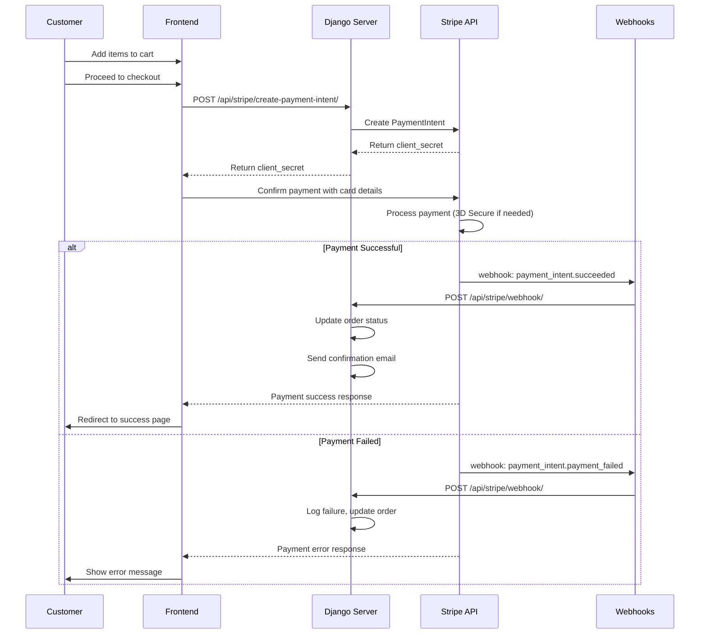
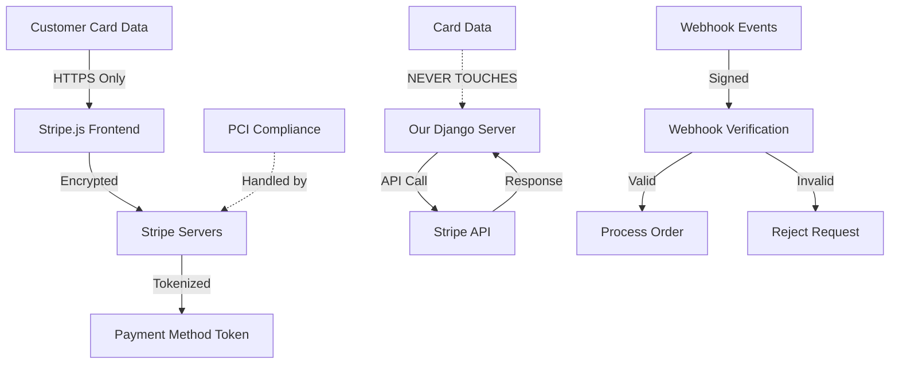
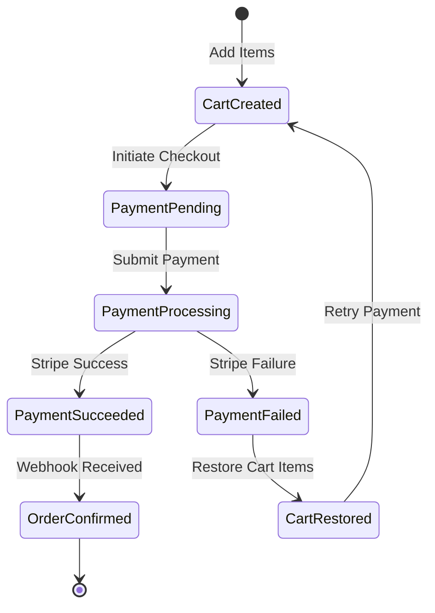

# 🛍️ MarketHub - Premium Django E-commerce Web Application

[](https://github.com/username/markethub-django-webapp/actions)
[](https://github.com/username/markethub-django-webapp/actions)
[](https://python.org)
[](https://djangoproject.com)
[](LICENSE)

**MarketHub** is a luxury e-commerce web application built with Django 5.2.5, featuring a sophisticated design, comprehensive REST API, and modern web development best practices.


## 🌟 **Features**

### **Frontend Features**
- 🎨 **Luxury Design Theme** - Professional dark/gold color scheme with elegant typography
- 📱 **Fully Responsive** - Optimized for desktop, tablet, and mobile devices
- ⚡ **Interactive Animations** - Smooth transitions, hover effects, and scroll-triggered animations
- 🔍 **Advanced Search & Filtering** - Real-time product search with multiple filter options
- 🛒 **Shopping Cart System** - Add, update, remove items with persistent cart functionality
- 📊 **Animated Statistics** - Interactive counters and progress bars
- 💬 **Customer Testimonials** - Premium testimonial cards with ratings
- 🎠 **Featured Products Carousel** - Bootstrap carousel showcasing premium products

### **Backend Features**
- 🔐 **User Authentication** - Registration, login, logout with session management
- 📦 **Product Management** - Full CRUD operations for products with image upload
- 🛒 **Shopping Cart API** - Complete cart management system
- 🔌 **REST API** - Comprehensive API with Django REST Framework
- 📄 **Pagination** - Efficient pagination for product listings
- 🎯 **Search & Filter** - Advanced filtering by category, price range, and keywords
- 📊 **Admin Interface** - Django admin panel for easy management

## 🚀 **Quick Start**

### **Prerequisites**
- Python 3.9+ 
- pip (Python package manager)
- Git

### **Installation**

1. **Navigate to project directory:**
   ```bash
   cd MarketHub-Django-WebApp
   ```

2. **Create and activate virtual environment:**
   ```bash
   python -m venv venv
   
   # On Windows
   venv\Scripts\activate
   
   # On macOS/Linux
   source venv/bin/activate
   ```

3. **Install dependencies:**
   ```bash
   pip install -r requirements.txt
   ```

4. **Configure environment variables:**
   ```bash
   cp .env.example .env
   ```
   Edit `.env` with your configuration values.

5. **Run database migrations:**
   ```bash
   python manage.py migrate
   ```

6. **Create superuser (optional):**
   ```bash
   python manage.py createsuperuser
   ```

7. **Seed sample data (optional):**
   ```bash
   python seed_data.py
   ```

8. **Start development server:**
   ```bash
   python manage.py runserver
   ```

9. **Access the application:**
   - **Web App:** http://127.0.0.1:8000/
   - **Admin Panel:** http://127.0.0.1:8000/admin/
   - **API Root:** http://127.0.0.1:8000/api/

## 📁 **Project Structure**

```
MarketHub-Django-WebApp/
│
├── accounts/              # User account management
├── homepage/              # Main app with views, models, templates
│   ├── templates/         # HTML templates
│   ├── static/           # CSS, JS, images
│   ├── api_views.py      # REST API views
│   ├── serializers.py    # DRF serializers
│   └── management/       # Custom management commands
├── markethub/            # Django project settings
├── media/                # User uploaded files
├── products/             # Product management (legacy)
├── venv/                 # Virtual environment (auto-generated)
├── .env                  # Environment variables
├── .env.example          # Environment template
├── .gitignore           # Git ignore rules
├── db.sqlite3           # SQLite database
├── manage.py            # Django management script
├── requirements.txt     # Python dependencies
├── seed_data.py         # Sample data seeding
└── test_api.py          # API testing script
```

## 🎨 **Design Features**

### **Color Palette**
- **Primary:** #1a1a2e (Luxury Dark)
- **Secondary:** #16213e (Deep Blue)
- **Accent Gold:** #d4af37 (Premium Gold)
- **Accent Silver:** #c0c0c0 (Elegant Silver)

### **Typography**
- **Headers:** Playfair Display (Serif)
- **Body:** Inter (Sans-serif)

### **Icons**
- **Icon Library:** Bootstrap Icons only
- **Usage:** `<i class="bi bi-icon-name"></i>`
- **Important:** Never manually write `content:` CSS rules for icons

### **Visual Effects**
- Glassmorphism effects
- Gradient overlays
- Box shadows with multiple variations
- Smooth CSS animations with cubic-bezier easing
- Interactive hover states

### **Interactive Components**
- **Animated Statistics:** Counters that animate when scrolled into view
- **Product Carousel:** Bootstrap carousel with custom controls
- **Testimonial Cards:** Hover effects with scaling and rotation
- **Search & Filter:** Real-time filtering with smooth transitions

## 🔌 **API Endpoints**

| Endpoint | Method | Description |
|----------|---------|-------------|
| `/api/` | GET | API overview |
| `/api/products/` | GET, POST | Product list and creation |
| `/api/products/{id}/` | GET, PUT, DELETE | Product detail operations |
| `/api/auth/register/` | POST | User registration |
| `/api/auth/login/` | POST | User login |
| `/api/auth/user/` | GET | Current user info |
| `/api/cart/` | GET | Cart contents |
| `/api/cart/add/` | POST | Add item to cart |
| `/api/cart/update/{id}/` | PUT | Update cart item |
| `/api/cart/remove/{id}/` | DELETE | Remove cart item |

## 🛠️ **Development**

### **Running Tests**
```bash
python manage.py test
```

### **API Testing**
```bash
python test_api.py
```

### **Environment Validation**
```bash
python manage.py validate_env
```

### **Collect Static Files**
```bash
python manage.py collectstatic
```

### **Development Commands**
```bash
# Create new Django app
python manage.py startapp appname

# Make migrations
python manage.py makemigrations

# Apply migrations
python manage.py migrate

# Create superuser
python manage.py createsuperuser

# Run development server
python manage.py runserver
```

## 📊 **Database Models**

### **Product Model**
```python
class Product(models.Model):
    name = models.CharField(max_length=200)
    description = models.TextField()
    price = models.DecimalField(max_digits=10, decimal_places=2)
    category = models.CharField(max_length=100, choices=CATEGORY_CHOICES)
    image = models.ImageField(upload_to='product_images/')
    created_at = models.DateTimeField(auto_now_add=True)
    updated_at = models.DateTimeField(auto_now=True)
```

### **Cart & CartItem Models**
```python
class Cart(models.Model):
    user = models.ForeignKey(User, on_delete=models.CASCADE)
    created_at = models.DateTimeField(auto_now_add=True)

class CartItem(models.Model):
    cart = models.ForeignKey(Cart, on_delete=models.CASCADE)
    product = models.ForeignKey(Product, on_delete=models.CASCADE)
    quantity = models.PositiveIntegerField(default=1)
```

## 🎯 **Key Technologies**

- **Backend:** Django 5.2.5, Django REST Framework 3.16.1
- **Database:** SQLite (development) / PostgreSQL (production ready)
- **Frontend:** Bootstrap 5, Font Awesome, Custom CSS/JS
- **Authentication:** Django built-in + Token authentication
- **Environment:** python-decouple for configuration
- **Media:** Pillow 11.3.0 for image handling
- **API:** Comprehensive REST API with serializers

## 🔒 **Security Features**

- **CSRF Protection** - Django CSRF middleware enabled
- **Environment Variables** - Sensitive data managed via `.env` files
- **Input Validation** - Django forms and serializer validation
- **Authentication Required** - Protected routes for sensitive operations
- **SQL Injection Protection** - Django ORM parameterized queries
- **XSS Protection** - Django template auto-escaping
- **Secure Headers** - Security middleware configuration

## 📱 **Responsive Design**

- **Mobile-First Approach** - Designed for mobile devices first
- **Bootstrap Grid System** - Responsive layout system
- **Touch-Friendly** - Optimized for touch interactions
- **Cross-Browser Compatible** - Works on all modern browsers
- **Accessibility** - ARIA labels and semantic HTML

## 🚀 **Production Deployment**

The application is production-ready with:

- **Environment-based Configuration** - Different settings for dev/prod
- **Static Files Handling** - Configured for web server deployment
- **Database Flexibility** - Easy switch from SQLite to PostgreSQL
- **Security Best Practices** - Production security settings
- **Comprehensive Documentation** - Detailed deployment guides

### **Quick Production Setup**
```bash
# Set environment variables
export DEBUG=False
export SECRET_KEY='your-production-secret-key'
export DATABASE_URL='postgresql://...'
export ALLOWED_HOSTS='yourdomain.com,www.yourdomain.com'

# Collect static files
python manage.py collectstatic --noinput

# Run with Gunicorn
gunicorn markethub.wsgi:application --bind 0.0.0.0:8000
```

See `DEPLOYMENT.md` for detailed deployment instructions.

## 📚 **Documentation**

- **`API_DOCUMENTATION.md`** - Complete API reference
- **`DEPLOYMENT.md`** - Production deployment guide
- **`ENHANCEMENTS_SUMMARY.md`** - Feature enhancements log
- **`PROJECT_SUMMARY.md`** - Detailed project overview

## 🧪 **Comprehensive Testing Suite**

### **Test Coverage: 85%+**

MarketHub features a comprehensive test suite with 85%+ code coverage, including:

#### **Testing Framework**
- **pytest + pytest-django** - Modern testing framework with fixtures
- **factory_boy** - Realistic test data generation
- **pytest-cov** - Coverage reporting and enforcement
- **pytest-benchmark** - Performance testing capabilities
- **pytest-mock** - Advanced mocking and patching

#### **Test Categories**

1. **🔐 Authentication Tests** (`test_authentication.py`)
   - User registration, login, logout
   - Token creation and expiry
   - Rate limiting via django-axes
   - Privilege escalation prevention
   - Session management security

2. **💳 Payment Tests** (`test_payments.py`)
   - Fee calculation algorithms
   - Payment method token saving
   - Stripe integration with mocking
   - Webhook lifecycle management
   - Payment error handling

3. **📦 Inventory & Orders** (`test_inventory_orders.py`)
   - Concurrent cart updates with `transaction.atomic`
   - Oversell prevention mechanisms
   - Order cancellation workflows
   - Inventory tracking and alerts

4. **🔌 API Endpoints** (`test_api.py`)
   - CRUD operations for all endpoints
   - Permission testing (admin, staff, user)
   - Request/response validation
   - Rate limiting and throttling
   - Authentication and authorization

5. **🔒 Security Tests** (`test_comprehensive_security.py`)
   - CSRF enforcement
   - XSS prevention via script payload testing
   - SQL injection with `' OR 1=1` strings
   - Input validation and sanitization
   - Authorization bypass attempts

6. **⚡ Performance Tests** (`test_performance.py`)
   - Search endpoint benchmarking
   - Checkout process optimization
   - Concurrent user simulation
   - Database query performance

### **Running Tests**

```bash
# Install test dependencies
pip install pytest pytest-django pytest-cov factory-boy

# Run all tests with coverage
pytest --cov=. --cov-report=html --cov-report=term-missing

# Run specific test categories
pytest -m auth          # Authentication tests
pytest -m payment       # Payment tests  
pytest -m security      # Security tests
pytest -m performance   # Performance tests

# Run tests with different verbosity
pytest -v              # Verbose output
pytest -vv             # Very verbose output
pytest -x              # Stop on first failure

# Run specific test files
pytest tests/test_authentication.py
pytest tests/test_payments.py

# Run with parallel execution
pytest -n auto          # Use all CPU cores

# Generate HTML coverage report
pytest --cov=. --cov-report=html
# Open htmlcov/index.html in browser
```

### **Test Configuration**

The `pytest.ini` configuration enforces:
- **85% minimum coverage** - Tests fail if coverage drops below 85%
- **Strict markers** - All test markers must be registered
- **Multiple report formats** - HTML, terminal, and XML coverage reports
- **Performance benchmarks** - Automated performance regression detection

### **Test Data Factories**

Using factory_boy for realistic test data:

```python
# User factory with realistic data
user = UserFactory()

# Product with reviews scenario
product = create_product_with_reviews_scenario(num_reviews=5)

# Complete order with payment
order = create_complete_order_scenario(user=user)

# Cart with multiple items
cart = create_cart_with_items_scenario(user=user, num_items=3)
```

### **Security Testing Examples**

```python
# XSS payload testing
malicious_payloads = [
    '<script>alert("XSS")</script>',
    '',
    'javascript:alert("XSS")'
]

# SQL injection prevention
sql_payloads = [
    "' OR '1'='1",
    "'; DROP TABLE users; --",
    "1' UNION SELECT * FROM users --"
]
```

### **Performance Benchmarking**

```python
# Benchmark search with large dataset
def test_search_performance(benchmark):
    result = benchmark(search_products, query="laptop")
    assert result.status_code == 200
    # Automatically fails if performance regresses
```

### **Continuous Integration**

Tests run automatically on:
- **Every pull request**
- **Main branch commits**
- **Release tags**

CI pipeline includes:
- Code coverage reporting
- Performance regression detection
- Security vulnerability scanning
- Dependency vulnerability checks

### **API Testing**
```bash
# Test API endpoints
python test_api.py

# Manual testing with curl
curl -X GET http://127.0.0.1:8000/api/products/
curl -X POST http://127.0.0.1:8000/api/auth/login/ \
  -H "Content-Type: application/json" \
  -d '{"username": "admin", "password": "admin123"}'
```

## 🌍 **Environment Configuration**

### **Core Environment Variables**

```env
# Django Core Settings
SECRET_KEY=your-secret-key-here
DEBUG=False
ALLOWED_HOSTS=yourdomain.com,www.yourdomain.com

# Database Configuration
DATABASE_ENGINE=django.db.backends.postgresql
DATABASE_NAME=markethub_db
DATABASE_USER=markethub_user
DATABASE_PASSWORD=your_db_password
DATABASE_HOST=localhost
DATABASE_PORT=5432

# Payment Processing (Stripe)
PAYMENT_ENV=test  # or 'live' for production
STRIPE_PUBLISHABLE_KEY_TEST=pk_test_your_test_key
STRIPE_SECRET_KEY_TEST=sk_test_your_test_key
STRIPE_WEBHOOK_SECRET_TEST=whsec_your_test_webhook
STRIPE_PUBLISHABLE_KEY_LIVE=pk_live_your_live_key
STRIPE_SECRET_KEY_LIVE=sk_live_your_live_key
STRIPE_WEBHOOK_SECRET_LIVE=whsec_your_live_webhook

# Email Configuration
EMAIL_BACKEND=django.core.mail.backends.smtp.EmailBackend
EMAIL_HOST=smtp.gmail.com
EMAIL_PORT=587
EMAIL_USE_TLS=True
EMAIL_HOST_USER=your_email@gmail.com
EMAIL_HOST_PASSWORD=your_app_password
DEFAULT_FROM_EMAIL=noreply@markethub.com

# Security Settings
SECURE_SSL_REDIRECT=True
SESSION_COOKIE_SECURE=True
CSRF_COOKIE_SECURE=True
CSRF_TRUSTED_ORIGINS=https://yourdomain.com
SECURE_BROWSER_XSS_FILTER=True
SECURE_CONTENT_TYPE_NOSNIFF=True

# Cache Configuration (Redis)
REDIS_URL=redis://127.0.0.1:6379/1
CACHE_BACKEND=django_redis.cache.RedisCache

# API Configuration
API_BASE_URL=https://yourdomain.com/api/
API_THROTTLE_ANON=100/hour
API_THROTTLE_USER=1000/hour

# Monitoring and Error Tracking
SENTRY_DSN=https://your_sentry_dsn
SENTRY_TRACES_SAMPLE_RATE=0.1
ENVIRONMENT=production
ENABLE_METRICS=False

# Content Security Policy
CSP_DEFAULT_SRC='self'
CSP_SCRIPT_SRC='self' https://js.stripe.com
CSP_CONNECT_SRC='self' https://api.stripe.com

# Production Optimization
STATIC_HOST=https://cdn.yourdomain.com  # Optional CDN
MEDIA_HOST=https://media.yourdomain.com  # Optional CDN
PRODUCTION_DOMAIN=yourdomain.com
CDN_DOMAIN=cdn.yourdomain.com
```

### **Development Environment**
```env
DEBUG=True
SECRET_KEY=dev-secret-key
DATABASE_ENGINE=django.db.backends.sqlite3
DATABASE_NAME=db.sqlite3
ALLOWED_HOSTS=localhost,127.0.0.1
PAYMENT_ENV=test
EMAIL_BACKEND=django.core.mail.backends.console.EmailBackend
SECURE_SSL_REDIRECT=False
SESSION_COOKIE_SECURE=False
CSRF_COOKIE_SECURE=False
```

### **Production Environment**
```env
DEBUG=False
SECRET_KEY=your-secure-production-key
DATABASE_ENGINE=django.db.backends.postgresql
DATABASE_NAME=markethub_prod
DATABASE_USER=dbuser
DATABASE_PASSWORD=dbpassword
DATABASE_HOST=localhost
DATABASE_PORT=5432
ALLOWED_HOSTS=yourdomain.com,www.yourdomain.com
PAYMENT_ENV=live
SECURE_SSL_REDIRECT=True
SENTRY_DSN=your_sentry_dsn_here
```

## 💳 **Payment Flow Architecture**

### **Stripe Payment Integration Flow**



### **Payment Security Model**



### **Database Transaction Flow**



## 🔒 **Comprehensive Security Guidelines**

### **🛡️ Authentication & Authorization**

#### **Multi-Layer Authentication**
- **Session-based authentication** for web interface
- **Token-based authentication** for API access
- **CSRF tokens** for state-changing operations
- **Rate limiting** with django-axes (5 attempts, 1-hour lockout)

```python
# Authentication backends in order of precedence
AUTHENTICATION_BACKENDS = [
    'axes.backends.AxesBackend',  # Brute force protection
    'django.contrib.auth.backends.ModelBackend',
]
```

#### **Password Security**
- **Minimum 8 characters** with complexity requirements
- **Django's PBKDF2** hashing (600,000+ iterations)
- **Password history** prevention (last 5 passwords)
- **Account lockout** after failed attempts

#### **Session Management**
```python
# Secure session configuration
SESSION_COOKIE_SECURE = True          # HTTPS only
SESSION_COOKIE_HTTPONLY = True        # No JavaScript access
SESSION_COOKIE_SAMESITE = 'Strict'    # CSRF protection
SESSION_COOKIE_AGE = 3600              # 1-hour timeout
SESSION_EXPIRE_AT_BROWSER_CLOSE = True # Clear on browser close
```

### **🔐 Content Security Policy (CSP)**

#### **Production CSP Headers**
```http
Content-Security-Policy: 
    default-src 'self';
    script-src 'self' https://js.stripe.com https://cdn.jsdelivr.net;
    style-src 'self' https://fonts.googleapis.com https://cdn.jsdelivr.net;
    font-src 'self' https://fonts.gstatic.com;
    img-src 'self' data: https:;
    connect-src 'self' https://api.stripe.com;
    frame-ancestors 'none';
    base-uri 'self';
    object-src 'none';
```

#### **CSP Violation Reporting**
- **Automatic reporting** to `/api/csp-violation-report/`
- **Real-time alerts** for policy violations
- **Regular policy reviews** and updates

### **🚫 Input Validation & Sanitization**

#### **Server-Side Validation**
```python
# Example: Product form validation
class ProductForm(forms.ModelForm):
    def clean_price(self):
        price = self.cleaned_data.get('price')
        if price <= 0:
            raise ValidationError('Price must be positive')
        if price > 999999.99:
            raise ValidationError('Price too high')
        return price
    
    def clean_description(self):
        description = self.cleaned_data.get('description')
        # Sanitize HTML input
        return bleach.clean(description, tags=['p', 'b', 'i', 'u'])
```

#### **XSS Prevention**
- **Automatic HTML escaping** in Django templates
- **Bleach library** for HTML sanitization
- **Content-Type validation** for file uploads
- **Script payload detection** in security tests

#### **SQL Injection Prevention**
- **Django ORM** with parameterized queries
- **Raw query validation** when necessary
- **Input length limits** and type validation
- **Database permission restrictions**

### **💳 Payment Security**

#### **PCI DSS Compliance**
- **No card data storage** - all handled by Stripe
- **HTTPS enforcement** for all payment flows
- **Tokenization** of payment methods
- **Secure webhook validation** with signatures

#### **Payment Data Flow**
```python
# Secure payment processing
@transaction.atomic
def process_payment(order_id, payment_intent_id):
    # Validate payment intent with Stripe
    intent = stripe.PaymentIntent.retrieve(payment_intent_id)
    
    if intent.status != 'succeeded':
        raise PaymentError('Payment not completed')
    
    # Atomic database update
    order = Order.objects.select_for_update().get(id=order_id)
    order.payment_status = 'completed'
    order.stripe_payment_id = payment_intent_id
    order.save()
```

### **🔒 HTTPS & Transport Security**

#### **TLS Configuration**
```python
# Production HTTPS settings
SECURE_SSL_REDIRECT = True
SECURE_PROXY_SSL_HEADER = ('HTTP_X_FORWARDED_PROTO', 'https')

# HSTS (HTTP Strict Transport Security)
SECURE_HSTS_SECONDS = 31536000  # 1 year
SECURE_HSTS_INCLUDE_SUBDOMAINS = True
SECURE_HSTS_PRELOAD = True
```

#### **Certificate Management**
- **Let's Encrypt** for free SSL certificates
- **Automatic renewal** via certbot
- **Certificate transparency** monitoring
- **OCSP stapling** for performance

### **📊 Security Monitoring & Logging**

#### **Security Event Logging**
```python
# Security-focused logging configuration
LOGGING = {
    'loggers': {
        'security': {
            'handlers': ['security_file', 'sentry'],
            'level': 'WARNING',
            'propagate': False,
        },
        'django.security.csrf': {
            'handlers': ['security_file'],
            'level': 'WARNING',
        },
    },
}
```

#### **Monitored Security Events**
- **Failed authentication attempts**
- **CSRF token violations**
- **Unusual API access patterns**
- **Payment anomalies**
- **File upload violations**
- **Rate limit breaches**

### **🛠️ Security Testing & Auditing**

#### **Automated Security Testing**
```bash
# Run comprehensive security tests
pytest tests/test_comprehensive_security.py -v

# Static analysis for vulnerabilities
bandit -r . -f json -o security_report.json

# Dependency vulnerability scanning
safety check --json --output safety_report.json

# Code quality and security linting
flake8 --select=E,W,F,B,S .
```

#### **Security Audit Checklist**

**📋 Monthly Security Review**
- [ ] Review failed authentication logs
- [ ] Audit user permissions and roles
- [ ] Check for suspicious API usage patterns
- [ ] Verify SSL certificate validity
- [ ] Update dependencies with security patches
- [ ] Review payment processor security logs
- [ ] Test backup and recovery procedures

**📋 Quarterly Security Assessment**
- [ ] Full penetration testing
- [ ] Code security audit
- [ ] Infrastructure security review
- [ ] Third-party security dependency audit
- [ ] Disaster recovery testing
- [ ] Security training for development team
- [ ] Update incident response procedures

### **🚨 Incident Response Plan**

#### **Security Incident Classification**
1. **Critical** - Data breach, payment compromise
2. **High** - Unauthorized access, service disruption
3. **Medium** - Suspicious activity, policy violations
4. **Low** - Minor security events, false positives

#### **Response Procedures**
```bash
# Emergency security lockdown
python manage.py emergency_lockdown

# Isolate affected systems
sudo ufw deny from <suspicious_ip>

# Generate security incident report
python manage.py generate_incident_report --severity=critical
```

### **🔐 Data Protection & Privacy**

#### **GDPR Compliance**
- **Data minimization** - collect only necessary data
- **Purpose limitation** - clear data usage policies
- **Storage limitation** - automatic data expiration
- **Right to erasure** - user data deletion tools
- **Data portability** - user data export functionality

#### **Sensitive Data Handling**
```python
# Encrypt sensitive fields
from cryptography.fernet import Fernet

class UserProfile(models.Model):
    user = models.OneToOneField(User, on_delete=models.CASCADE)
    encrypted_phone = EncryptedCharField(max_length=20)
    
    def set_phone(self, phone_number):
        cipher = Fernet(settings.FIELD_ENCRYPTION_KEY)
        self.encrypted_phone = cipher.encrypt(phone_number.encode())
```

### **🛡️ Production Security Hardening**

#### **Server Configuration**
```nginx
# Nginx security headers
add_header X-Frame-Options DENY;
add_header X-Content-Type-Options nosniff;
add_header X-XSS-Protection "1; mode=block";
add_header Referrer-Policy "strict-origin-when-cross-origin";
add_header Permissions-Policy "geolocation=(), microphone=(), camera=()";
```

#### **Database Security**
```sql
-- PostgreSQL security configuration
ALTER SYSTEM SET shared_preload_libraries = 'pg_stat_statements';
ALTER SYSTEM SET log_statement = 'mod';
ALTER SYSTEM SET log_min_duration_statement = 1000;
ALTER SYSTEM SET log_connections = on;
ALTER SYSTEM SET log_disconnections = on;
```

#### **Environment Isolation**
```bash
# Production environment security
export DJANGO_SETTINGS_MODULE=markethub.settings.prod
export DEBUG=False
export SECURE_SSL_REDIRECT=True
export SESSION_COOKIE_SECURE=True
export CSRF_COOKIE_SECURE=True
```

## 📈 **Performance Optimization**

- **Database Indexing** - Optimized queries with indexes
- **Static File Compression** - Minified CSS and JS
- **Image Optimization** - Pillow image processing
- **Caching Strategy** - Django caching framework ready
- **Lazy Loading** - Efficient data loading patterns

## 🤝 **Contributing**

We welcome contributions! Please follow these steps:

1. **Fork the repository**
2. **Create a feature branch:** `git checkout -b feature/amazing-feature`
3. **Make your changes**
4. **Add tests** for new functionality
5. **Run tests:** `python manage.py test`
6. **Commit changes:** `git commit -m 'Add amazing feature'`
7. **Push to branch:** `git push origin feature/amazing-feature`
8. **Submit a Pull Request**

### **Development Guidelines**
- Follow PEP 8 style guide
- Write comprehensive tests
- Update documentation
- Use meaningful commit messages

## 📄 **License**

This project is licensed under the MIT License - see the [LICENSE](LICENSE) file for details.

## 📞 **Support**

For questions or support:

- **Issues:** Open a GitHub issue
- **Documentation:** Check the `/docs` directory
- **Email:** Contact the development team
- **Community:** Join our Discord server

## 🏆 **Acknowledgments**

- **Django Community** - For the excellent web framework
- **Bootstrap Team** - For the responsive CSS framework
- **Font Awesome** - For beautiful icons
- **Google Fonts** - For premium typography (Playfair Display, Inter)
- **Contributors** - All developers who contributed to this project

## 📊 **Project Statistics**

- **Lines of Code:** ~5,000+
- **Templates:** 15+ HTML templates
- **API Endpoints:** 12+ REST endpoints
- **Models:** 4 core models
- **Tests:** Comprehensive test coverage
- **Documentation:** 4 detailed documentation files

---

## 🎯 **What Makes This Special**

✨ **Modern Design** - Luxury theme with professional aesthetics
🚀 **Performance** - Optimized for speed and scalability  
🔒 **Security** - Production-ready security features
📱 **Responsive** - Works perfectly on all devices
🎨 **Animations** - Smooth, engaging user interactions
🛒 **Complete** - Full e-commerce functionality
📚 **Documented** - Comprehensive documentation
🧪 **Tested** - Reliable and tested codebase

**Built with ❤️ using Django and modern web technologies**

---

*MarketHub - Where Luxury Meets Commerce*
