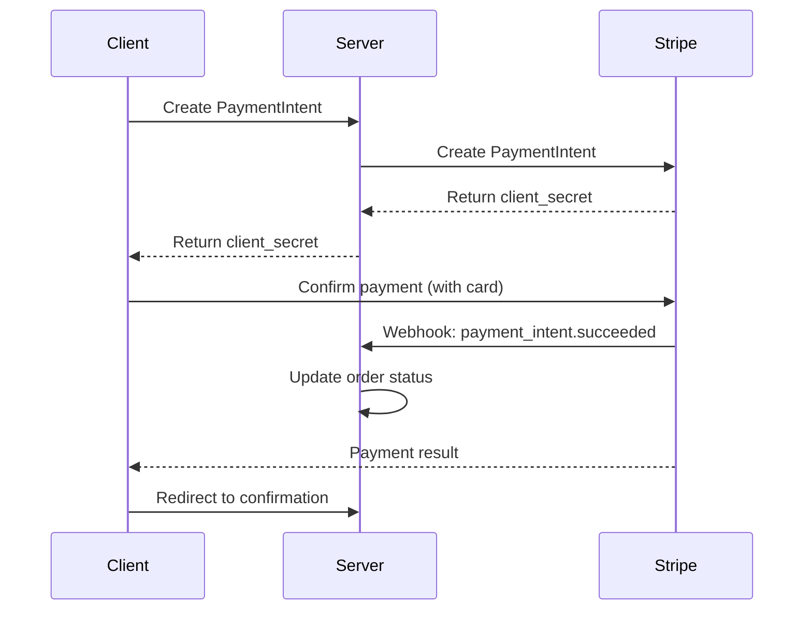

# Stripe Payment Integration Guide

This document provides comprehensive information about the Stripe payment integration in MarketHub.

## Overview

MarketHub uses Stripe as the primary payment processor, implementing a secure, PCI-compliant payment system that supports:

- Credit/Debit card payments
- 3D Secure authentication
- Payment method storage for returning customers
- Webhook event processing
- Refund management
- Test and live environment switching

## Configuration

### Environment Variables

Add the following variables to your `.env` file:

```bash
# Payment Environment (test/live)
PAYMENT_ENV=test

# Stripe Test Keys
STRIPE_PUBLISHABLE_KEY_TEST=pk_test_your_test_publishable_key
STRIPE_SECRET_KEY_TEST=sk_test_your_test_secret_key
STRIPE_WEBHOOK_SECRET_TEST=whsec_your_test_webhook_secret

# Stripe Live Keys (for production)
STRIPE_PUBLISHABLE_KEY_LIVE=pk_live_your_live_publishable_key
STRIPE_SECRET_KEY_LIVE=sk_live_your_live_secret_key
STRIPE_WEBHOOK_SECRET_LIVE=whsec_your_live_webhook_secret
```

### Required Python Package

Install the Stripe Python library:

```bash
pip install stripe
```

## Features

### 1. PaymentIntent Workflow

The integration uses Stripe's PaymentIntent API for secure payment processing:

- **Client-side**: Stripe.js handles card collection and validation
- **Server-side**: PaymentIntent creation and confirmation
- **Security**: No card data touches your servers

### 2. Webhook Processing

Handles the following Stripe webhook events:

- `payment_intent.succeeded` - Payment completed successfully
- `payment_intent.payment_failed` - Payment failed
- `charge.dispute.created` - Chargeback/dispute created

### 3. Saved Payment Methods

Users can optionally save payment methods for future purchases:

- Payment methods are tokenized and stored securely in Stripe
- Only metadata (last 4 digits, brand) stored locally
- Automatic customer creation and management

### 4. Refund Management

Two methods for processing refunds:

#### Management Command
```bash
# Full refund by payment ID
python manage.py stripe_refund --payment-id 123

# Partial refund by PaymentIntent ID
python manage.py stripe_refund --payment-intent-id pi_xxx --amount 50.00

# Dry run to preview refund
python manage.py stripe_refund --payment-id 123 --dry-run
```

#### Admin Action
Select payments in Django Admin and use "Process Stripe refunds" action.

## Testing

### Test Card Numbers

Use these test cards for different scenarios:

#### Successful Payments
- **Visa**: 4242424242424242
- **Visa (debit)**: 4000056655665556
- **Mastercard**: 5555555555554444
- **American Express**: 378282246310005

#### Failed Payments
- **Generic decline**: 4000000000000002
- **Insufficient funds**: 4000000000009995
- **Lost card**: 4000000000009987
- **Stolen card**: 4000000000009979

#### 3D Secure Testing
- **Authentication required**: 4000002500003155
- **Authentication fails**: 4000008400001629

### Test Details
- **CVV**: Any 3-4 digit number
- **Expiry**: Any future date
- **ZIP/Postal**: Any valid format

### Testing Webhooks

1. **Stripe CLI** (recommended for local development):
```bash
stripe login
stripe listen --forward-to localhost:8000/api/stripe/webhook/
```

2. **ngrok** for exposing local server:
```bash
ngrok http 8000
# Use the HTTPS URL for webhook endpoint in Stripe Dashboard
```

## Database Models

### Extended Payment Model

The `Payment` model includes Stripe-specific fields:

```python
class Payment(models.Model):
    # ... existing fields ...
    
    # Stripe-specific fields
    stripe_payment_intent_id = models.CharField(max_length=255, blank=True, null=True)
    stripe_customer_id = models.CharField(max_length=255, blank=True, null=True)
    is_refunded = models.BooleanField(default=False)
```

### PaymentMethod Model

Stores tokenized payment methods:

```python
class PaymentMethod(models.Model):
    user = models.ForeignKey(User, on_delete=models.CASCADE)
    card_type = models.CharField(max_length=20)
    last_four = models.CharField(max_length=4)
    token = models.CharField(max_length=255)  # Stripe payment method ID
    is_default = models.BooleanField(default=False)
    is_active = models.BooleanField(default=True)
```

## Security Considerations

1. **PCI Compliance**: Card data never touches your servers
2. **Webhook Validation**: All webhooks are verified using Stripe signatures
3. **Environment Separation**: Clear separation between test and live modes
4. **Token Storage**: Only encrypted tokens stored, never raw card data

## Error Handling

The system handles various error scenarios:

- **Network failures**: Retry logic with exponential backoff
- **Card declines**: User-friendly error messages
- **3D Secure**: Automatic handling of authentication flows
- **Webhook failures**: Logged for manual review

## Edge Cases

### Duplicate Payments
- PaymentIntent IDs ensure idempotency
- Database constraints prevent duplicate order payments

### Amount Mismatches
- Server-side validation ensures amount integrity
- Order totals recalculated before payment processing

### Timeout Handling
- Client-side timeout after 30 seconds
- Server-side cleanup of abandoned PaymentIntents

## Production Checklist

### Pre-Launch
- [ ] Switch `PAYMENT_ENV` to `live`
- [ ] Update Stripe keys to live environment
- [ ] Configure production webhook endpoint
- [ ] Test with real (small) transactions
- [ ] Verify SSL certificate validity
- [ ] Review Stripe Dashboard settings

### Post-Launch Monitoring
- [ ] Monitor webhook delivery success rates
- [ ] Set up alerts for failed payments
- [ ] Regular reconciliation with Stripe Dashboard
- [ ] Monitor dispute/chargeback rates

### Switch to Live Environment

1. **Update Environment Variables**:
```bash
PAYMENT_ENV=live
STRIPE_PUBLISHABLE_KEY_LIVE=pk_live_...
STRIPE_SECRET_KEY_LIVE=sk_live_...
STRIPE_WEBHOOK_SECRET_LIVE=whsec_...
```

2. **Configure Webhooks in Stripe Dashboard**:
   - Add your production webhook endpoint
   - Enable required events: `payment_intent.succeeded`, `payment_intent.payment_failed`
   - Copy webhook secret to environment variables

3. **Test Live Mode**:
   - Use a real card with small amount ($1.00)
   - Verify payment processing end-to-end
   - Test webhook delivery
   - Process a test refund

## Troubleshooting

### Common Issues

1. **"No such payment_intent"**: Check PaymentIntent ID format
2. **"Invalid webhook signature"**: Verify webhook secret
3. **"Amount mismatch"**: Ensure amounts are in cents for Stripe API
4. **"Customer not found"**: Customer may have been deleted from Stripe

### Debug Mode

Enable debug logging for Stripe operations:

```python
# In settings.py
LOGGING['loggers']['stripe'] = {
    'handlers': ['console'],
    'level': 'DEBUG',
    'propagate': True,
}
```

### Support

For technical issues:
1. Check Stripe Dashboard logs
2. Review Django application logs
3. Verify webhook delivery in Stripe Dashboard
4. Contact Stripe Support for payment-specific issues

## API Endpoints

- `POST /api/stripe/create-payment-intent/<order_id>/` - Create PaymentIntent
- `POST /api/stripe/confirm-payment/` - Confirm payment client-side
- `POST /api/stripe/webhook/` - Process Stripe webhooks

## Integration Flow



This integration provides a robust, secure payment processing system that scales from development to production while maintaining PCI compliance and excellent user experience.
