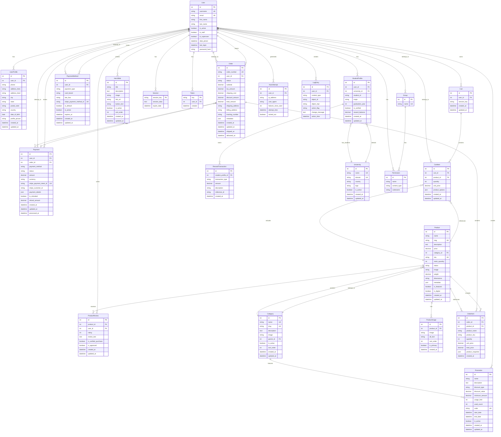

# MarketHub Database Entity Relationship Diagram (ERD)

This document provides a comprehensive Entity Relationship Diagram for the MarketHub e-commerce platform database structure.

## 🗂️ **Database Overview**

MarketHub uses a relational database design optimized for e-commerce operations, featuring:

- **User Management**: Django's built-in user system with custom profiles
- **Product Catalog**: Hierarchical category system with detailed product information  
- **Shopping Cart**: Session-based and persistent cart functionality
- **Order Processing**: Complete order lifecycle management
- **Payment Integration**: Stripe payment processing with audit trails
- **Security**: Comprehensive audit logging and access controls

## 📊 **Entity Relationship Diagram**



## 🔗 **Relationship Details**

### **User Management Relationships**

1. **User ↔ UserProfile** (One-to-One)
   - Each user has exactly one profile with extended information
   - Cascading delete: Profile deleted when user is deleted

2. **User ↔ Cart** (One-to-Many)
   - Users can have multiple carts (for different sessions)
   - Anonymous users identified by session key

3. **User ↔ Order** (One-to-Many)
   - Users can place multiple orders
   - Orders retain user information even if user is deactivated

### **Product Catalog Relationships**

4. **Category ↔ Product** (One-to-Many)
   - Products belong to exactly one category
   - Categories can be hierarchical (self-referential)
   - Category changes affect product organization

5. **Product ↔ ProductImage** (One-to-Many)
   - Products can have multiple images
   - One primary image per product
   - Images sorted by display order

6. **Product ↔ ProductReview** (One-to-Many)
   - Products can have multiple reviews
   - Reviews linked to verified purchases
   - Moderation system for review approval

### **Shopping Cart Relationships**

7. **Cart ↔ CartItem** (One-to-Many)
   - Carts contain multiple items
   - Items store snapshot of product details
   - Quantity and pricing tracked per item

8. **CartItem ↔ Product** (Many-to-One)
   - Cart items reference current product
   - Product changes don't affect existing cart items

### **Order Processing Relationships**

9. **Order ↔ OrderItem** (One-to-Many)
   - Orders contain multiple line items
   - Items store complete product snapshot
   - Immutable record for audit purposes

10. **Order ↔ Payment** (One-to-One)
    - Each order has exactly one payment
    - Payment status determines order fulfillment

### **Payment System Relationships**

11. **User ↔ PaymentMethod** (One-to-Many)
    - Users can save multiple payment methods
    - Tokenized storage via Stripe
    - One default payment method per user

12. **Payment ↔ Stripe Integration**
    - Payment Intent ID for idempotency
    - Customer ID for recurring payments
    - Webhook event tracking

## 📋 **Database Indexes**

### **Performance Optimization Indexes**

```sql
-- Product search and filtering
CREATE INDEX idx_product_category_price ON homepage_product(category_id, price);
CREATE INDEX idx_product_status_featured ON homepage_product(status, is_featured);
CREATE INDEX idx_product_created_desc ON homepage_product(created_at DESC);

-- Full-text search
CREATE INDEX idx_product_search ON homepage_product 
USING GIN(to_tsvector('english', name || ' ' || description));

-- Cart and order performance
CREATE INDEX idx_cartitem_cart_product ON homepage_cartitem(cart_id, product_id);
CREATE INDEX idx_order_user_status ON homepage_order(user_id, status);
CREATE INDEX idx_order_created_desc ON homepage_order(created_at DESC);

-- Payment tracking
CREATE INDEX idx_payment_stripe_intent ON homepage_payment(stripe_payment_intent_id);
CREATE INDEX idx_payment_user_status ON homepage_payment(user_id, status);

-- User lookup optimization
CREATE INDEX idx_user_email_active ON auth_user(email, is_active);
CREATE INDEX idx_user_username_active ON auth_user(username, is_active);

-- Security and audit
CREATE INDEX idx_axes_attempt_ip_time ON axes_axesattempt(ip_address, attempt_time);
CREATE INDEX idx_session_expire_date ON django_session(expire_date);
```

## 🔒 **Data Constraints and Validation**

### **Database Constraints**

```sql
-- Price validation
ALTER TABLE homepage_product 
ADD CONSTRAINT chk_product_price_positive 
CHECK (price >= 0);

-- Stock quantity validation  
ALTER TABLE homepage_product 
ADD CONSTRAINT chk_product_stock_non_negative 
CHECK (stock_quantity >= 0);

-- Cart item quantity validation
ALTER TABLE homepage_cartitem 
ADD CONSTRAINT chk_cartitem_quantity_positive 
CHECK (quantity > 0);

-- Order total validation
ALTER TABLE homepage_order 
ADD CONSTRAINT chk_order_total_non_negative 
CHECK (total_amount >= 0);

-- Payment amount validation
ALTER TABLE homepage_payment 
ADD CONSTRAINT chk_payment_amount_positive 
CHECK (amount > 0);

-- Review rating validation
ALTER TABLE homepage_productreview 
ADD CONSTRAINT chk_review_rating_range 
CHECK (rating >= 1 AND rating <= 5);
```

## 🔄 **Data Migration Considerations**

### **Schema Evolution Strategy**

1. **Backward Compatible Changes**
   - Adding nullable columns
   - Adding new tables
   - Adding indexes
   - Extending varchar lengths

2. **Breaking Changes** (Require Migration)
   - Changing column types
   - Adding NOT NULL constraints
   - Dropping columns/tables
   - Modifying primary/foreign keys

3. **Migration Best Practices**
   - Backup before major changes
   - Test migrations on staging
   - Use reversible migrations
   - Monitor performance impact

## 📊 **Data Volume Estimates**

### **Production Scaling Projections**

| Table | Initial | 1 Year | 5 Years |
|-------|---------|---------|----------|
| User | 1K | 10K | 100K |
| Product | 500 | 5K | 50K |
| Order | 100 | 5K | 100K |
| CartItem | 1K | 20K | 500K |
| Payment | 100 | 5K | 100K |
| ProductReview | 50 | 2K | 25K |

### **Storage Requirements**

- **Initial**: ~100 MB
- **1 Year**: ~1 GB  
- **5 Years**: ~10 GB (without media files)
- **Media Files**: 10-100x larger than database

## 🛠️ **Database Tools and Utilities**

### **Management Commands**

```bash
# Generate ERD automatically
python manage.py graph_models -a -g -o markethub_erd.png

# Database statistics
python manage.py dbshell -c "\dt+ homepage_*"

# Index usage analysis
python manage.py dbshell -c "SELECT * FROM pg_stat_user_indexes;"

# Data integrity checks
python manage.py check --database default
```

### **Monitoring Queries**

```sql
-- Table sizes
SELECT 
    schemaname,
    tablename,
    pg_size_pretty(pg_total_relation_size(schemaname||'.'||tablename)) as size
FROM pg_tables 
WHERE schemaname = 'public'
ORDER BY pg_total_relation_size(schemaname||'.'||tablename) DESC;

-- Slow queries
SELECT query, calls, total_time, mean_time 
FROM pg_stat_statements 
ORDER BY total_time DESC 
LIMIT 10;

-- Index effectiveness
SELECT 
    schemaname,
    tablename,
    attname,
    n_distinct,
    correlation
FROM pg_stats 
WHERE schemaname = 'public'
ORDER BY n_distinct DESC;
```

---

## 🔄 **Database Evolution Timeline**

### **Phase 1: Core E-commerce** ✅
- User management
- Product catalog
- Shopping cart
- Basic orders

### **Phase 2: Enhanced Features** ✅  
- Payment processing
- User reviews
- Student rewards
- Content management

### **Phase 3: Future Enhancements** 🔄
- Advanced analytics
- Recommendation engine
- Multi-vendor support
- Internationalization

---

*This ERD represents the current state of the MarketHub database as of v1.0.0. For the most up-to-date schema, generate the ERD using the Django management commands.*
